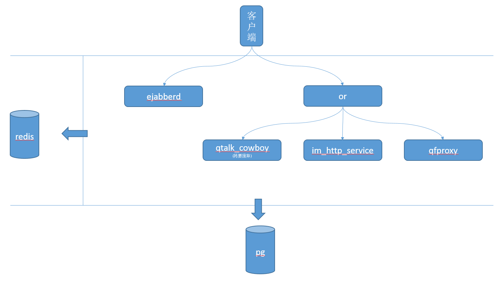

# QTalk EJABBERD

QTalk是基于ejabberd，根据业务需要改造而来。修改和扩展了很多
ejaberd不支持的功能。

## 关键功能

-   分布式：去掉了依赖mnesia集群的代码，来支持更大的集群，以及防止由于网络分区导致的集群状态不一致。
-   消息处理：通过ejabberd和kafka相连接，实现了消息的路由和订阅发布，可以对消息添加更丰富的处理逻辑。
-   &#x2026;

## QTalk模块

### QTalk主要包含：

+ [ejabberd](https://github.com/qunarcorp/ejabberd-open)

IM核心组件，负责维持与客户端的长连接和消息路由

+ [or](https://github.com/qunarcorp/or_open)

IM负载均衡组件，负责验证客户端身份，以及转发http请求到对应的后台服务
+ [im_http_service](https://github.com/qunarcorp/im_http_service_open)

IM HTTP接口服务，负责IM相关数据的查询、设置以及历史消息同步

+ [qtalk_cowboy](https://github.com/qunarcorp/qtalk_cowboy_open)(后面所有的接口都会迁移到im_http_service，这个服务会废弃)

IM HTTP接口服务，负责IM相关数据的查询、设置以及历史消息同步，后面会全部迁移到im_http_service上

+ [qfproxy](https://github.com/qunarcorp/qfproxy_open)

IM文件服务，负责文件的上传和下载

+ redis

IM缓存服务

+ postgresql

IM数据库服务

### QTalk各个模块之间的关系



## 安装

前提条件：

+ 所有项目都安装到/home/work下面
+ 安装用户和用户组是：foo:foo，要保证foo用户有sudo权限
+ 家目录下有download文件夹，所有文件会下载到该文件夹下
+ 数据库用户名密码是ejabberd:123456，服务地址是：127.0.0.1
+ redis密码是：123456，服务地址是：127.0.0.1
+ 数据库初始化sql在doc目录下
+ 保证可访问主机的：5222、5202、8080端口
+ IM服务的域名是:qtalk.test.org

```
依赖包
# sudo yum install epel-release
# sudo yum -y update
# sudo yum -y groupinstall Base "Development Tools" "Perl Support"
# sudo yum -y install openssl openssl-devel unixODBC unixODBC-devel pkgconfig libSM libSM-devel libxslt ncurses-devel libyaml libyaml-devel expat expat-devel libxml2-devel libxml2 java-1.8.0-openjdk  java-1.8.0-openjdk-devel  pam-devel pcre-devel gd-devel bzip2-devel zlib-devel libicu-devel libwebp-devel gmp-devel curl-devel postgresql-devel libtidy libtidy-devel recode aspell libmcrypt  libmemcached gd

redis安装
sudo yum install -y redis
sudo vim /etc/redis.conf
 
daemonize yes
requirepass 123456
 
启动redis
sudo redis-server /etc/redis.conf
 
数据库安装
sudo yum -y install https://download.postgresql.org/pub/repos/yum/11/redhat/rhel-7-x86_64/pgdg-centos11-11-2.noarch.rpm
sudo yum -y install postgresql11 postgresql11-server postgresql11-libs
 
sudo /usr/pgsql-11/bin/postgresql-11-setup initdb
sudo systemctl enable postgresql-11
sudo systemctl start postgresql-11
 
修改posgres的密码
sudo passwd postgres
su - postgres
psql -f /home/monkboy/download/qtalk.sql
psql
# ALTER USER ejabberd WITH PASSWORD '123456';

插入测试账号：
# insert into host_info (host, description, host_admin) values ('qtalk.test.org', 'qtalk.test.org', 'test');
# insert into host_users (host_id, user_id, user_name, department, dep1, pinyin, frozen_flag, version, user_type, hire_flag, gender, password, initialpwd, ps_deptid) values ('1', 'test', '测试账号', '/机器人', '机器人', 'test', '0', '1', 'U', '1', '1', '1234567890', '1', 'qtalk');
# insert into vcard_version (username, version, profile_version, gender, host, url) values ('test', '1', '1', '1', 'qtalk.test.org', 'https://qt.qunar.com/file/v2/download/avatar/1af5bc967f8535a4af19eca10dc95cf1.png');

修改配置文件
[monkboy@monk download]$ sudo vim /var/lib/pgsql/11/data/pg_hba.conf
 
# "local" is for Unix domain socket connections only
local   all             all                                     peer
# IPv4 local connections:
host    all             all             127.0.0.1/32            md5
# IPv6 local connections:
host    all             all             ::1/128                 md5

新建安装目录
# sudo mkdir /home/work
# sudo chown foo:foo /home/work

下载源码
# cd /home/foo/download
# git clone https://github.com/memacs/ejabberd-open.git
# git clone https://github.com/memacs/or_open.git
# git clone https://github.com/memacs/qtalk_cowboy_open.git


openresry安装
# cd /home/foo/download
# wget https://openresty.org/download/openresty-1.13.6.2.tar.gz
# tar -zxvf openresty-1.13.6.2.tar.gz
# ./configure --prefix=/home/work/openresty
# make
# make install

or安装
# cd /home/foo/download
# cd or_open
# cp -rf conf /home/work/openresty/nginx
# cp -rf lua_app /home/work/openresty/nginx

or配置修改

location的配置
/home/work/openresry/nginx/conf/conf.d/subconf/or.server.location.package.qtapi.conf

upstream的配置
/home/work/openresry/nginx/conf/conf.d/upstreams/qt.qunar.com.upstream.conf

redis连接地址配置
/home/work/openresry/nginx/lua_app/checks/qim/qtalkredis.lua

or操作
启动：/home/work/openresry/nginx/sbin/nginx
停止：/home/work/openresry/nginx/sbin/nginx -s stop


安装erlang
# cd /home/foo/download
# wget http://erlang.org/download/otp_src_19.3.tar.gz
# tar -zxvf otp_src_19.3.tar.gz
# cd otp_src_19.3
# ./configure --prefix=/home/work/erlang1903
# make
# make install

添加PATH
# vim ~/.bash_profile
 
----------------------------------
# User specific environment and startup programs
ERLANGPATH=/home/work/erlang1903
PATH=$PATH:$HOME/bin:$ERLANGPATH/bin
----------------------------------
 
# . .bash_profile

安装ejabberd
# cd /home/foo/download
# cd ejabberd-open/
# ./configure --prefix=/home/work/ejabberd --with-erlang=/home/work/erlang1903 --enable-pgsql --enable-full-xml
# make
# make install
# cp ejabberd.yml.qunar /home/work/ejabberd/etc/ejabberd/ejabberd.yml
# cp ejabberdctl.cfg.qunar /home/work/ejabberd/etc/ejabberd/ejabberdctl.cfg
# vim /home/work/ejabberd/etc/ejabberd/ejabberd.yml
# vim /home/work/ejabberd/etc/ejabberd/ejabberdctl.cfg

ejabberd配置
参考 https://github.com/qunarcorp/ejabberd-open/blob/master/doc/setting.md

启动ejabberd

# cd /home/work/ejabberd
启动
# ./sbin/ejabberdctl start
停止
# ./sbin/ejabberdctl stop

安装qtalk_cowboy
# cd /home/foo/download
# cp -rf qtalk_cowboy_open /home/work/qtalk_cowboy
# cd /home/work/qtalk_cowboy/
# ./rebar compile

启动qtalk_cowboy
# ./bin/ejb_http_server start
停止qtalk_cowboy
# ./bin/ejb_http_server stop


安装java服务
# cd /home/foo/download/
# cp -rf or_open/deps/tomcat /home/work/
# cd tomcat

放置war
+ 将im_http_service.war放到/home/work/tomcat/im_http_service/webapps下面
+ 将qfproxy.war放到/home/work/tomcat/qfproxy/webapps下面


修改导航地址：
#  vim /home/work/tomcat/im_http_service/webapps/im_http_service/WEB-INF/classes/nav.json

-
{
  "Login": {
    "loginType": "password"
  },
  "baseaddess": {
    "simpleapiurl": "http://ip:8080",
    "fileurl": "http://ip:8080",
    "domain": "qtalk.test.org",
    "javaurl": "http://ip:8080/package",
    "protobufPcPort": 5202,
    "xmpp": "ip",
    "xmppport": 5222,
    "protobufPort": 5202,
    "pubkey": "rsa_public_key",
    "xmppmport": 5222,
    "httpurl": "http://ip:8080/newapi",
    "apiurl": "http://ip:8080/api"
  },
  "imConfig": {
    "RsaEncodeType": 1,
    "showOrganizational": true
  },
  "version": 10005
}
-
将ip替换成对应机器的ip地址


修改文件服务器配置

# vim /home/work/tomcat/qfproxy/webapps/qfproxy/WEB-INF/classes/qfproxy.properties

project.host.and.port=http://ip:8080

将ip替换成对应机器的ip地址

启动java服务
# cd /home/work/tomcat/im_http_service
# ./tomcat.sh start


# cd /home/work/tomcat/qfproxy
# mkdir upload //新建文件存储的目录
# ./tomcat.sh start


客户端配置导航地址：http://ip:8080/newapi/nck/qtalk_nav.qunar，使用账号：test，密码：1234567890登陆
```

## 配置文件修改

参考文档[setting.md](doc/setting.md)

## 开发指南

- [developer guide](https://docs.ejabberd.im/developer/guide/)
-

## 问题反馈

-   qchat@qunar.com（邮件）
